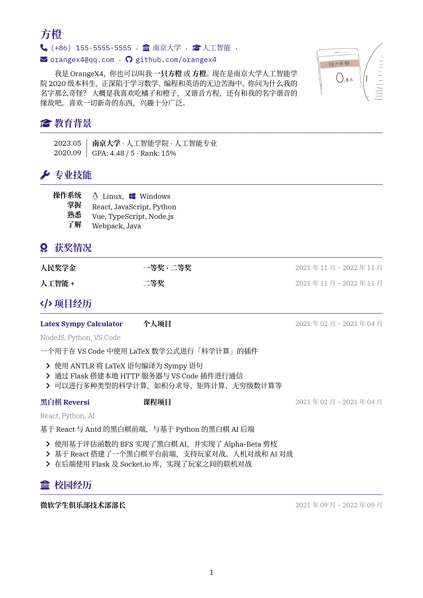
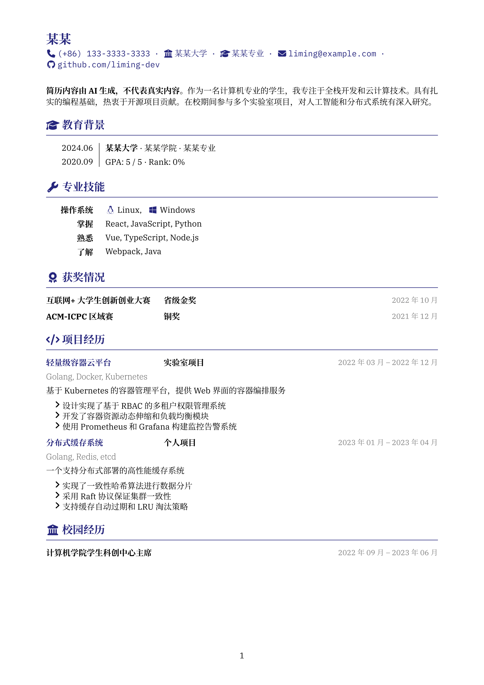
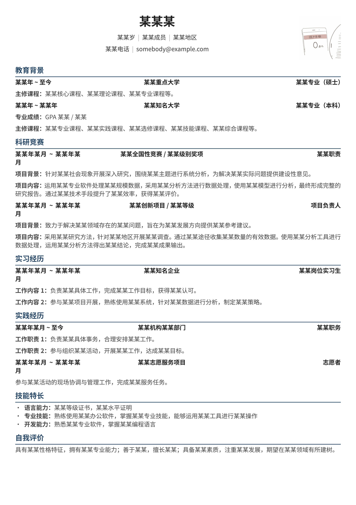

# Chinese Resume in Typst

使用 Typst 编写的中文简历.

样式上, 参考了 [liweitianux/resume](https://github.com/liweitianux/resume) 与 [uniquecv](https://github.com/dyinnz/uniquecv). 同时也参考了一部分 [uniquecv-typst](https://github.com/gaoachao/uniquecv-typst) 的写法.

语法上, 基于以下 Typst 的设计原则编写 (简洁一致与组合原则):

> - **Simplicity through Consistency:** If you know how to do one thing in Typst, you should be able to transfer that knowledge to other things. If there are multiple ways to do the same thing, one of them should be at a different level of abstraction than the other. E.g. it's okay that `= Introduction` and `#heading[Introduction]` do the same thing because the former is just syntax sugar for the latter.
> - **Power through Composability:** There are two ways to make something flexible: Have a knob for everything or have a few knobs that you can combine in many ways. Typst is designed with the second way in mind. We provide systems that you can compose in ways we've never even thought of. TeX is also in the second category, but it's a bit low-level and therefore people use LaTeX instead. But there, we don't really have that much composability. Instead, there's a package for everything (\usepackage{knob}).


## 使用

### 在线编辑

可以使用 Typst 的 Web App,

模板链接: https://typst.app/project/rw1SLr0IIZZnCrkrsypRQF


### 本地编辑（推荐）

- 安装 VS Code，以及 [Tinymist Typst](https://marketplace.visualstudio.com/items?itemName=myriad-dreamin.tinymist) 插件。
- 打开 `resume.typ` 文件，按下 `Ctrl + K V` 快捷键后即可显示与编辑。
- 点击源代码顶部的 `Export PDF` 即可导出 PDF 文件。


## 效果

包含照片:



不包含照片:




## 示例

你可以使用 **简洁** 与 **组合式** 的语法出美观的效果.

```typst
// 设置简历选项与头部
#show: resume.with(
  // 字体和基准大小
  size: 10pt,
  // 标题颜色
  theme-color: theme-color,
  // 控制纸张的边距
  margin: (
    top: 1.5cm,
    bottom: 2cm,
    left: 2cm,
    right: 2cm,
  ),

  // 如果需要姓名及联系信息居中，请删除下面关于头像的三行参数，并取消headerCenter的注释
  //headerCenter : true,

  // 如果不需要头像，则将下面三行的参数注释或删除
  photograph: "profile.jpg",
  photograph-width: 10em,
  gutter-width: 2em,
)[
  = 某某

  #info(
    color: theme-color,
    (
      icon: fa-phone,
      content: "(+86) 133-3333-3333",
    ),
    (
      icon: fa-building-columns,
      content: "某某大学",
    ),
    (
      icon: fa-graduation-cap,
      content: "某某专业",
    ),
    (
      icon: fa-envelope,
      content: "liming@example.com",
      link: "mailto:liming@example.com",
    ),
    (
      icon: fa-github,
      content: "github.com/liming-dev",
      link: "https://github.com/liming-dev",
    ),
  )
][
  #h(2em)

  *简历内容由 AI 生成，不代表真实内容。*作为一名计算机专业的学生，我专注于全栈开发和云计算技术。具有扎实的编程基础，热衷于开源项目贡献。在校期间参与多个实验室项目，对人工智能和分布式系统有深入研究。
]
```

以及每一个块

```typst
== #fa-graduation-cap 教育背景

#sidebar(with-line: true, side-width: 12%)[
  2024.06

  2020.09
][
  *某某大学* · 某某学院 · 某某专业

  GPA: 5 / 5 · Rank: 0%
]
```

```typst
== #fa-code 项目经历

#item(
  link(
    "https://github.com/liming-dev/cloud-platform",
    [ *轻量级容器云平台* ],
  ),
  [ *实验室项目* ],
  date[ 2022 年 03 月 – 2022 年 12 月 ],
)

#tech[ Golang, Docker, Kubernetes ]

基于 Kubernetes 的容器管理平台，提供Web界面的容器编排服务

- 设计实现了基于 RBAC 的多租户权限管理系统
- 开发了容器资源动态伸缩和负载均衡模块
- 使用 Prometheus 和 Grafana 构建监控告警系统
```


## 模板过于复杂？

上面的模板是否过于复杂？想从一个简单的模板入门 Typst？不想修改复杂的 `template.typ` 文件？

可以尝试一下不需要模板文件、仅需要 Typst 原生语法的 [简单模板](examples/simple.typ)：



```typst
#let cv-color = rgb("#284967")
#set page(margin: (x: 0.9cm, y: 1.0cm))
#set text(font: "Noto Sans CJK SC", size: 10pt)
#set par(justify: true)
#let chiline = {
  v(-8pt)
  line(stroke: cv-color, length: 100%)
  v(-2pt)
}
#show "|": text(gray, " | ")
#show heading.where(level: 1): it => text(fill: rgb("#222222"), size: 20pt, it) + v(5pt)
#show heading.where(level: 2): it => text(cv-color, it) + chiline
#let item(a, b, c) = grid(
  columns: (20%, 1fr, 30%),
  align: (left, center, right),
  text(fill: rgb("#222222"), weight: "bold", a),
  text(rgb("#222222"), weight: "bold", b),
  text(rgb("#222222"), weight: "bold", c),
)

// -------------------------------------------------------------------
// 个人简历正文
// -------------------------------------------------------------------


#grid(
  columns: (1fr, auto),
  align(center)[
    = 某某某

    #set text(rgb("#333333"))

    某某岁 | 某某成员 | 某某地区
    
    某某电话 | somebody\@example.com
  ], image(width: 70pt, "profile.jpg")
)

#set text(rgb("#444444"))

== 教育背景

#item[某某年 \~ 至今][某某重点大学][某某专业（硕士）]

*主修课程：*某某核心课程、某某理论课程、某某专业课程等。

#item[某某年 \~ 某某年][某某知名大学][某某专业（本科）]

*专业成绩：*GPA 某某 / 某某

*主修课程：*某某专业课程、某某实践课程、某某选修课程、某某技能课程、某某综合课程等。

== 科研竞赛

#item[某某年某月 \~ 某某年某月][某某全国性竞赛 / 某某级别奖项][某某职责]

*项目背景：*针对某某社会现象开展深入研究，围绕某某主题进行系统分析，为解决某某实际问题提供建设性意见。

*项目内容：*运用某某专业软件处理某某规模数据，采用某某分析方法进行数据处理，使用某某模型进行分析，最终形成完整的研究报告。通过某某技术手段提升了某某效率，获得某某评价。

#item[某某年某月 \~ 某某年某月][某某创新项目 / 某某等级][项目负责人]

*项目背景：*致力于解决某某领域存在的某某问题，旨在为某某发展方向提供某某参考建议。

*项目内容：*采用某某研究方法，针对某某地区开展某某调查。通过某某途径收集某某数量的有效数据。使用某某分析工具进行数据处理，运用某某分析方法得出某某结论，完成某某成果输出。

== 实习经历

#item[某某年某月 \~ 某某年某月][某某知名企业][某某岗位实习生]

*工作内容1：*负责某某具体工作，完成某某工作目标，获得某某认可。

*工作内容2：*参与某某项目开展，熟练使用某某系统，针对某某数据进行分析，制定某某策略。

== 实践经历

#item[某某年某月 \~ 至今][某某机构某某部门][某某职务]

*工作职责1：*负责某某具体事务，合理安排某某工作。

*工作职责2：*参与组织某某活动，开展某某工作，达成某某目标。

#item[某某年某月 \~ 某某年某月][某某志愿服务项目][志愿者]
参与某某活动的现场协调与管理工作，完成某某服务任务。

== 技能特长

- *语言能力：*某某等级证书，某某水平证明
- *专业技能：*熟练使用某某办公软件，掌握某某专业技能，能够运用某某工具进行某某操作
- *开发能力：*熟悉某某专业软件，掌握某某编程语言

== 自我评价

具有某某性格特征，拥有某某专业能力；善于某某，擅长某某；具备某某素质，注重某某发展，期望在某某领域有所建树。
```
